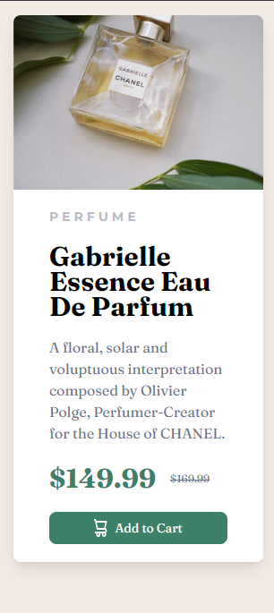

# Frontend Mentor - Product preview card component solution

This is a solution to the [Product preview card component challenge on Frontend Mentor](https://www.frontendmentor.io/challenges/product-preview-card-component-GO7UmttRfa). Frontend Mentor challenges help you improve your coding skills by building realistic projects.

## Table of contents

-   [Overview](#overview)
    -   [The challenge](#the-challenge)
    -   [Screenshot](#screenshot)
    -   [Links](#links)
-   [My process](#my-process)
    -   [Built with](#built-with)
    -   [What I learned](#what-i-learned)
    -   [Continued development](#continued-development)
    -   [Useful resources](#useful-resources)
-   [Author](#author)
-   [Acknowledgments](#acknowledgments)

## Overview

This is just a simple project to practice my HTML and CSS skills. I found this on Frontend Mentor and decided to give it a try.

### The challenge

Users should be able to:

-   View the optimal layout depending on their device's screen size
-   See hover and focus states for interactive elements

### Screenshot

This is the desktop view:


This is the mobile view:


### Links

-   Solution URL: [https://github.com/stephenlit/product-preview](https://github.com/stephenlit/product-preview)
-   Live Site URL: [https://stephenlit.github.io/product-preview/](https://stephenlit.github.io/product-preview/)

## My process

So this was pretty simple project. I wanted to do this using the Astro framework to learn more about setting it up and using it.
I added tailwind for the styling in this project as well, I have not used it much before and I am still learning it.

I took out pencile and drew out the layout so that I could get a better understanding of the layout. I decided to use flex for the main layout because it seem best.
Likely could of done it in grid but flex worked better with the flow of the page.I didn't start this mobile first becuase it seem to be more logical to do it
desktop first.

### Built with

-   Semantic HTML5 markup
-   CSS
-   Flexbox
-   [Astro]https://astro.build/) - Astro framework
-   [Tailwind](https://tailwindcss.com/) - CSS framework

### What I learned

I learned how to set up the Astro framework and install Tailwind in it. Astro makes it really easy to get started with Tailwind—you can simply use the CLI to install it by running npx astro add tailwind. Setting up the custom styles wasn’t too difficult either. Here’s my Tailwind configuration file. I know the naming could be improved, but this is what I came up with.

```/** @type {import('tailwindcss').Config} */
export default {
    content: ['./src/**/*.{astro,html,js,jsx,md,mdx,svelte,ts,tsx,vue}'],
    theme: {
        extend: {
            colors: {
                cyan: 'hsl(158, 36%, 37%)',
                cream: 'hsl(30, 38%, 92%)',

                darkBlue: 'hsl(212, 21%, 14%)',
                darkGrayishBlue: 'hsl(228, 12%, 48%)',
                white: 'hsl(0, 0%, 100%)',
            },
            fontFamily: {
                sans: ['Montserrat', 'sans-serif'],
                heading: ['Fraunces', 'serif'],
            },
        },
    },
    plugins: [],
};
```

### Continued development

I’m planning to move on to more challenging projects. I did this one just to get my feet wet. I really like the Astro framework, and next, I’m going to create components for my upcoming project. It’s incredibly simple to add a React .jsx component to Astro.

### Useful resources

-   [Astro](https://astro.build/) - The documentation for Astro is really well done and easy to follow.
-   [Tailwind](https://tailwindcss.com/) - The documentation for Tailwind is really easy to follow.
-   [Colt Steel Discord](https://discord.gg/AKFkMuYC) - The discord for Colt Steel. There are a lot of great people in this server

## Author

-   Stephen Little -[Frontend Mentor](https://www.frontendmentor.io)

## Acknowledgments

The people on Colt Steele's Discord server are an excellent resource for learning. They’re always happy to help, but make sure to ask for help properly by providing context and sharing relevant code.
